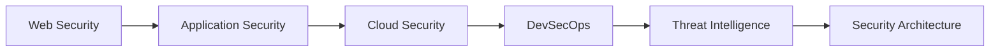

# Hi there! 👋 I'm **Khushi Anand**

### Cyber Security Enthusiast · Full Stack Developer · Automation Lover

I build secure, scalable, user-friendly applications and automate security workflows to make the digital world safer and smarter.

 

## 👩‍💻 Professional Snapshot

- 🔭 **Currently working on:** Security automation, vulnerability management workflows, application testing, and web applications.
- 🌱 **Currently learning:** Penetration testing, cloud security, application security, DevSecOps, Docker, Kubernetes, and threat intelligence.
- 🔐 **Security focus:** Cybersecurity, ethical hacking, penetration testing, application testing, cloud security, vulnerability management, Nessus / Qualys, and threat intelligence.
- 💻 **Development focus:** Python, React.js, MERN stack, Angular, Node.js, MongoDB, UI/UX, APIs, and full-stack web applications.
- ⚙️ **Automation mindset:** I love building scripts, dashboards, reports, and workflows that reduce manual security and operations effort.
- 💬 **Ask me about:** Cybersecurity, penetration testing, vulnerability management, Python automation, Docker, Kubernetes, MERN, React.js, and web development.
- 📫 **Reach me at:** [anandkhushi0911@gmail.com](mailto:anandkhushi0911@gmail.com)
- ⚡ **Fun fact:** I think I'm funny, cute, pretty, beautiful, smart — and now also security-minded 😼

 

---

## 📌 Profile Highlights

| 📊 Contributions | 📁 Repositories | 🚀 Projects | 💜 Mindset |
| :---: | :---: | :---: | :---: |
| **250+** | **15+** | **5+** | **Always learning, always building, always securing.** |

---

## 🎯 Core Interests

| Cybersecurity | Penetration Testing | Cloud Security | Application Testing | Vulnerability Management | Automation |
| :---: | :---: | :---: | :---: | :---: | :---: |
| 🛡️ | ⚔️ | ☁️ | 🐞 | 🔎 | ⚙️ |

| Docker | Kubernetes | Python | Web Development | MERN Stack | React.js |
| :---: | :---: | :---: | :---: | :---: | :---: |
| 🐳 | ☸️ | 🐍 | 🌐 | 🍃 | ⚛️ |

---

## 🛠️ Security Arsenal

| Vulnerability & AppSec | Recon & Testing | Threat Intelligence | Automation & Ops |
| --- | --- | --- | --- |
| Nessus | Nmap | OpenCTI | Python scripts |
| Qualys | OWASP ZAP | Sigma | Security dashboards |
| Burp Suite | Dirbuster | John The Ripper | Vulnerability reports |
| Wireshark | Metasploit | Hydra | Workflow automation |

---

## 🧰 Tech Stack

### Frontend

  
  
  
  
  
  

### Backend & Databases

  
  
  
  
  

### Tools, DevOps & Languages

  
  
  
  
  
  
  
  
  

---

## 🚀 What I Do

| 🔐 Cyber Security & AppSec | ☁️ Cloud Security | 🐞 Vulnerability Management |
| --- | --- | --- |
| Application testing, secure coding, and risk awareness. | AWS fundamentals, cloud security concepts, and scalable systems. | Nessus / Qualys workflows, reports, and remediation tracking. |

| ⚙️ Security Automation | 🔁 DevSecOps & CI/CD | 👁️ Threat Intelligence |
| --- | --- | --- |
| Python scripts, repeatable workflows, and dashboards. | Security-minded build and deployment practices. | OpenCTI research, observables, and intelligence workflows. |

---

## 🗺️ Learning Roadmap

---

## 📂 Featured Projects

| Project | Focus | Stack |
| --- | --- | --- |
| **Vulnerability Automation** | Automating Nessus and vulnerability management workflows. | Python |
| **Security Dashboard** | Centralized vulnerability tracking and reporting. | Python, Pandas, Streamlit |
| **Angular Web Apps** | Responsive frontend applications. | Angular, TypeScript |
| **OpenCTI Research** | Threat intelligence research and CTI integrations. | OpenCTI, Python |
| **Portfolio Website** | Personal portfolio built with a modern stack. | React, Node.js |

---

## 🏆 Certifications

- AWS Cloud Practitioner
- IBM Cybersecurity Fundamentals
- Palo Alto Networks Cybersecurity
- Honeywell Cybersecurity
- Coursera Multiple Certifications

---

## 🤝 Let's Connect

 
 

> **Secure today, so tomorrow can innovate.** 🔒

